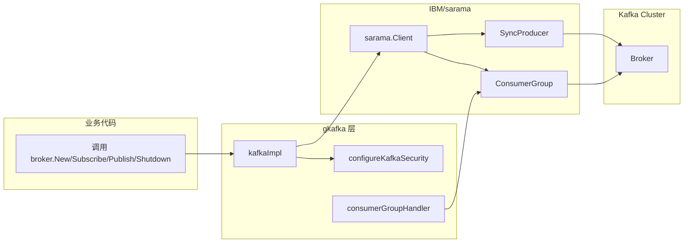
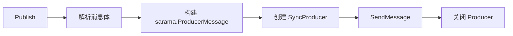
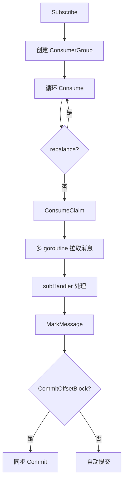

# gkafka

`gkafka` 是 `go-god/broker` 针对 Apache Kafka 的实现，基于 [IBM/sarama](https://github.com/IBM/sarama) 封装，对外统一实现 `broker.Broker` 接口。

## 目录

- [架构设计](#架构设计)
- [核心特性](#核心特性)
- [快速开始](#快速开始)
- [配置说明](#配置说明)
- [发布消息](#发布消息)
- [订阅消息](#订阅消息)
- [安全协议](#安全协议)

## 架构设计



### 模块职责

| 文件 | 职责 |
|------|------|
| `kafka.go` | `kafkaImpl` 定义、`New` 构造、`Publish`/`Subscribe`/`Shutdown` 实现、SASL/TLS 配置 |
| `consumer_group_impl.go` | 实现 `sarama.ConsumerGroupHandler`，处理消费、ACK、缓冲、key 路由 |
| `scram_client.go` | 基于 `xdg-go/scram` 实现 SCRAM-SHA-256/512 认证客户端 |

## 核心特性

- **多协议支持**：`PLAINTEXT`、`SASL_PLAINTEXT`、`SASL_SSL`
- **SASL 机制**：`PLAIN`、`SCRAM-SHA-256`、`SCRAM-SHA-512`
- **TLS 证书**：支持自定义 CA 证书路径与 `InsecureSkipVerify`
- **生产者**：每次 `Publish` 从共享 `sarama.Client` 创建 `SyncProducer`，支持消息 Key 与 Headers
- **消费者组**：基于 `sarama.ConsumerGroup`，自动处理 rebalance
- **多种消费模式**：
  - 直接消费（默认）
  - Key 路由消费
  - 完整消息元数据消费
  - 缓冲队列消费（`EnableMsgBuffer`）
- **Offset 提交**：默认自动提交，支持阻塞同步提交（`CommitOffsetBlock`）
- **优雅关闭**：`Shutdown` 带超时控制关闭客户端

## 快速开始

```go
package main

import (
    "context"
    "log"
    "time"

    "github.com/go-god/broker"
    "github.com/go-god/broker/gkafka"
)

func main() {
    b := gkafka.New(
        broker.WithBrokerAddress("localhost:9092"),
        broker.WithLogger(broker.LoggerFunc(log.Printf)),
        broker.WithGracefulWait(5*time.Second),
    )
    defer b.Shutdown(context.Background())

    // publish
    _ = b.Publish(context.Background(), "my-topic", "hello kafka")

    // subscribe
    _ = b.Subscribe(context.Background(), "my-topic", "group-1",
        func(ctx context.Context, data []byte) error {
            log.Println("received:", string(data))
            return nil
        },
    )
}
```

## 配置说明

| Option | 说明 | 默认值 |
|--------|------|--------|
| `WithBrokerAddress` | Kafka broker 地址列表 | 必填 |
| `WithKafkaProtocol` | 协议：`PLAINTEXT` / `SASL_PLAINTEXT` / `SASL_SSL` | `PLAINTEXT` |
| `WithSaslMechanism` | SASL 机制：`PLAIN` / `SCRAM-SHA-256` / `SCRAM-SHA-512` | `PLAIN` |
| `WithUser` | SASL 用户名 | `""` |
| `WithPassword` | SASL 密码 | `""` |
| `WithCertPath` | CA 证书路径（仅 SASL_SSL） | `""` |
| `WithInsecureSkipVerify` | 跳过证书校验（仅 SASL_SSL） | `false` |
| `WithOperationTimeout` | 生产者操作超时 | `10s` |
| `WithConnectionTimeout` | 连接超时 | `10s` |
| `WithConsumerAutoCommitInterval` | 消费者自动提交间隔 | `1s` |
| `WithGracefulWait` | 优雅关闭等待时间 | `5s` |

## 发布消息



```go
_ = b.Publish(ctx, "my-topic", map[string]string{"k": "v"},
    broker.WithPublishName("order-123"),          // 消息 key，用于分区
    broker.WithPublishHeader("trace-id", []byte("xxx")),
)
```

## 订阅消息



### 基本消费

```go
_ = b.Subscribe(ctx, "my-topic", "group-1",
    func(ctx context.Context, data []byte) error {
        log.Println("data:", string(data))
        return nil
    },
)
```

### 带缓冲的消费

```go
_ = b.Subscribe(ctx, "my-topic", "group-1",
    func(ctx context.Context, data []byte) error {
        log.Println("data:", string(data))
        return nil
    },
    broker.WithSubPullMsgGoroutines(3),
    broker.WithSubEnableMsgBuffer(),
    broker.WithSubMsgBufferSize(1024),
    broker.WithSubConsumeMsgBufferGoroutines(3),
)
```

### Key 路由消费

```go
_ = b.Subscribe(ctx, "my-topic", "group-1",
    func(ctx context.Context, data []byte) error {
        log.Println("default:", string(data))
        return nil
    },
    broker.WithSubKeyHandlers(map[string]broker.SubHandler{
        "order": func(ctx context.Context, data []byte) error {
            log.Println("order:", string(data))
            return nil
        },
    }),
)
```

## 安全协议

### SASL_PLAINTEXT

```go
b := gkafka.New(
    broker.WithBrokerAddress("localhost:9092"),
    broker.WithKafkaProtocol("SASL_PLAINTEXT"),
    broker.WithUser("admin"),
    broker.WithPassword("your-password"),
)
```

### SASL_SSL

```go
b := gkafka.New(
    broker.WithBrokerAddress("kafka.example.com:9093"),
    broker.WithKafkaProtocol("SASL_SSL"),
    broker.WithSaslMechanism("SCRAM-SHA-256"),
    broker.WithUser("admin"),
    broker.WithPassword("your-password"),
    broker.WithCertPath("/path/to/ca.crt"),
    broker.WithInsecureSkipVerify(false),
)
```

## 注意事项

- 消费者组要求 Kafka 版本 `>= V0_10_2_0`
- `Subscribe` 是阻塞调用，通常在独立 goroutine 中运行
- `Shutdown` 会关闭 `stop` channel，消费循环收到信号后退出
