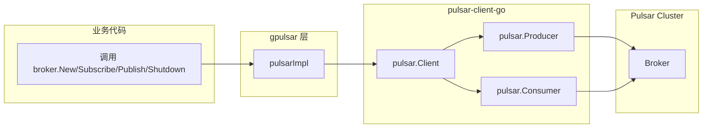
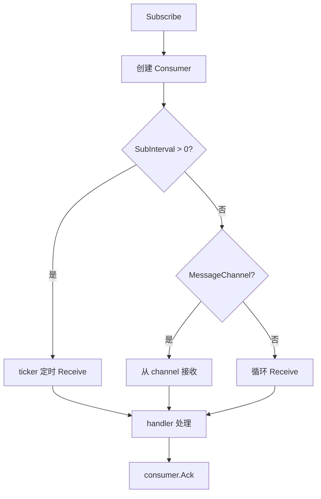

# gpulsar

`gpulsar` 是 `go-god/broker` 针对 Apache Pulsar 的实现，基于 [apache/pulsar-client-go](https://github.com/apache/pulsar-client-go) 封装，对外统一实现 `broker.Broker` 接口。

## 目录

- [架构设计](#架构设计)
- [核心特性](#核心特性)
- [快速开始](#快速开始)
- [配置说明](#配置说明)
- [发布消息](#发布消息)
- [订阅消息](#订阅消息)

## 架构设计



### 模块职责

| 文件 | 职责 |
|------|------|
| `pulsar.go` | `pulsarImpl` 定义、`New` 构造、`Publish`/`Subscribe`/`Shutdown` 实现 |

## 核心特性

- **Token 认证**：通过 `WithAuthToken` 配置 JWT Token
- **ListenerName**：支持 VPC 等场景下的网络监听名配置
- **连接池控制**：`MaxConnectionsPerBroker` 控制单 broker 连接数
- **生产者**：从共享 `pulsar.Client` 创建 `Producer`，支持发送超时与批次延迟
- **消费者**：基于 `pulsar.Consumer`，支持多种订阅类型
- **消费模式**：
  - 拉模式（`Receive` 轮询，默认）
  - 推模式（`MessageChannel`）
  - 定时拉模式（`SubInterval`）
- **自动 ACK**：业务 handler 成功后自动调用 `consumer.Ack`
- **优雅关闭**：`Shutdown` 带超时控制关闭客户端

## 快速开始

```go
package main

import (
    "context"
    "log"
    "time"

    "github.com/go-god/broker"
    "github.com/go-god/broker/gpulsar"
)

func main() {
    b := gpulsar.New(
        broker.WithBrokerAddress("pulsar://localhost:6650"),
        broker.WithLogger(broker.LoggerFunc(log.Printf)),
        broker.WithGracefulWait(5*time.Second),
    )
    defer b.Shutdown(context.Background())

    // publish
    _ = b.Publish(context.Background(), "my-topic", "hello pulsar")

    // subscribe
    _ = b.Subscribe(context.Background(), "my-topic", "sub-1",
        func(ctx context.Context, data []byte) error {
            log.Println("received:", string(data))
            return nil
        },
    )
}
```

## 配置说明

| Option | 说明 | 默认值 |
|--------|------|--------|
| `WithBrokerAddress` | Pulsar broker URL，多个地址用 `,` 连接 | 必填 |
| `WithAuthToken` | JWT Token 认证 | `""` |
| `WithListenerName` | 网络监听名（VPC 场景） | `""` |
| `WithOperationTimeout` | 操作超时 | `20s` |
| `WithConnectionTimeout` | 连接超时 | `10s` |
| `WithMaxConnectionsPerBroker` | 单 broker 最大连接数 | `1` |
| `WithNoDataWaitSec` | 无数据时 sleep 秒数 | `3` |
| `WithGracefulWait` | 优雅关闭等待时间 | `5s` |

## 发布消息


```go
_ = b.Publish(ctx, "my-topic", map[string]string{"k": "v"},
    broker.WithPublishName("producer-1"),
    broker.WithPublishDelay(10*time.Millisecond),
)
```

## 订阅消息



### 基本消费

```go
_ = b.Subscribe(ctx, "my-topic", "sub-1",
    func(ctx context.Context, data []byte) error {
        log.Println("data:", string(data))
        return nil
    },
)
```

### 指定订阅类型

```go
_ = b.Subscribe(ctx, "my-topic", "sub-1",
    func(ctx context.Context, data []byte) error {
        log.Println("data:", string(data))
        return nil
    },
    broker.WithSubType(broker.Exclusive), // 或 broker.Shared / broker.Failover
)
```

### MessageChannel 模式

```go
_ = b.Subscribe(ctx, "my-topic", "sub-1",
    func(ctx context.Context, data []byte) error {
        log.Println("data:", string(data))
        return nil
    },
    broker.WithSubMessageChannel(),
    broker.WithSubMessageChannelSize(100),
)
```

### 定时拉取模式

```go
_ = b.Subscribe(ctx, "my-topic", "sub-1",
    func(ctx context.Context, data []byte) error {
        log.Println("data:", string(data))
        return nil
    },
    broker.WithSubInterval(2*time.Second),
)
```

## 注意事项

- `Subscribe` 是阻塞调用，通常在独立 goroutine 中运行
- `Shutdown` 会关闭 `stop` channel，消费循环收到信号后退出
- 多个 broker 地址通过 `WithBrokerAddress("pulsar://host1:6650,pulsar://host2:6650")` 传入
