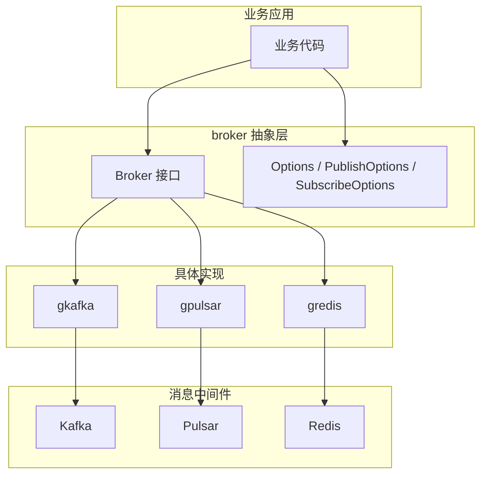

# broker

`go-god/broker` 是一个统一的 Go 消息队列抽象层，业务代码只需面向 `broker.Broker` 接口编程，即可在 Kafka、Pulsar、Redis 等不同消息中间件之间切换。

## 架构设计



## 接口定义

```go
type Broker interface {
    Publish(ctx context.Context, topic string, msg interface{}, opts ...PubOption) error
    Subscribe(ctx context.Context, topic string, channel string, handler SubHandler, opts ...SubOption) error
    Shutdown(ctx context.Context) error
}
```

## 核心实现

| 实现 | 依赖 | 文档 |
|------|------|------|
| [gkafka](gkafka/) | [IBM/sarama](https://github.com/IBM/sarama) | [gkafka/readme.md](gkafka/readme.md) |
| [gpulsar](gpulsar/) | [apache/pulsar-client-go](https://github.com/apache/pulsar-client-go) | [gpulsar/readme.md](gpulsar/readme.md) |
| [gredis](gredis/) | [redis/go-redis](https://github.com/redis/go-redis) | 参考 gredis 测试用例 |

## 快速开始

```go
package main

import (
    "context"
    "log"

    "github.com/go-god/broker"
    "github.com/go-god/broker/gkafka"
)

func main() {
    b := gkafka.New(
        broker.WithBrokerAddress("localhost:9092"),
        broker.WithLogger(broker.LoggerFunc(log.Printf)),
    )
    defer b.Shutdown(context.Background())

    _ = b.Publish(context.Background(), "my-topic", "hello broker")

    _ = b.Subscribe(context.Background(), "my-topic", "group-1",
        func(ctx context.Context, data []byte) error {
            log.Println("received:", string(data))
            return nil
        },
    )
}
```

切换 Pulsar 只需要替换实现：

```go
import "github.com/go-god/broker/gpulsar"

b := gpulsar.New(
    broker.WithBrokerAddress("pulsar://localhost:6650"),
)
```

## 通用 Option

| Option | 说明 |
|--------|------|
| `WithBrokerAddress` | broker 地址列表 |
| `WithUser` | 用户名（Kafka SASL） |
| `WithPassword` | 密码（Kafka SASL） |
| `WithLogger` | 日志接口 |
| `WithOperationTimeout` | 操作超时 |
| `WithConnectionTimeout` | 连接超时 |
| `WithGracefulWait` | 优雅关闭等待时间 |

各实现还有自己专属的 Option，详见对应实现文档。

## Pulsar in docker

https://pulsar.apache.org/docs/2.11.x/getting-started-docker/

```shell
docker rm -f `docker ps -a | grep pulsar-server | awk '{print $1}'`
docker run -idt \
--name pulsar-server \
-p 6650:6650 \
-p 8080:8080 \
--mount source=pulsardata,target=/pulsar/data \
--mount source=pulsarconf,target=/pulsar/conf \
apachepulsar/pulsar:2.9.5 \
bin/pulsar standalone
```

## 注意事项

- Kafka 消费者组要求 Kafka 版本 `>= V0_10_2_0`，低于该版本请使用 `go-god/broker v1.1.2`
- 具体使用方式请参考 `gkafka` / `gpulsar` / `gredis` 下的测试用例与专属文档
